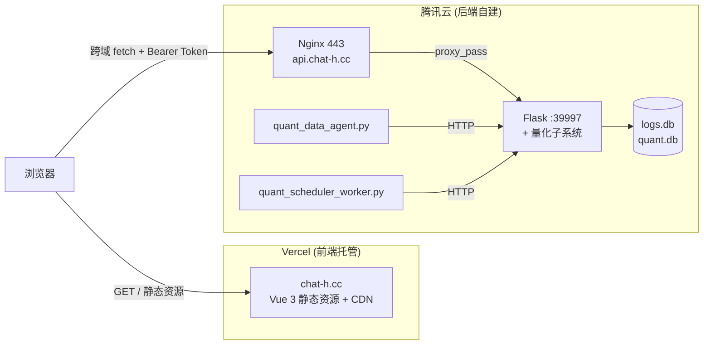

# Frontend Vercel Deployment Refactoring Plan

> **状态**：草案 v0.1
> **最后更新**：2026-08-27
> **目标**：前端完全独立部署到 Vercel，后端保留在自建腾讯云服务器，通过 `api.chat-h.cc` 跨域访问
> **依赖输入**：见 §7「待确认事项清单」，用户从服务器导出 / 描述现状后冻结为 v1.0

---

## 1. 背景与目标

### 1.1 背景

当前项目采用「单域名 + Nginx 反代」架构（来源：`cyf/project/fe/nginx.conf.tpl`）：

```
chat-h.cc → Nginx(80) → 前端静态 + 反代 /api /health /upload /models → Flask(39997)
```

该架构将所有能力耦合在同一台腾讯云服务器上：手动 `scp` 前端 dist、依赖宝塔面板续签 SSL、Nginx 维护、量化子系统与 Web 共享 39997 端口。

### 1.2 目标

| # | 目标 | 验收标准 |
|---|------|---------|
| G1 | 前端完全托管到 Vercel | `git push` 触发 Vercel 自动 build + deploy；旧服务器不再托管前端静态 |
| G2 | 后端保留自建腾讯云 | Flask + 量化子系统 + SQLite 全部继续在原服务器运行 |
| G3 | 用独立子域隔离前后端 | 前端 `chat-h.cc`、后端 `api.chat-h.cc`，通过 HTTPS + CORS 跨域通信 |
| G4 | 保留所有现有后端能力 | 文件上传（20 MB）、量化子系统、WebSocket、任意内部端口均可继续工作 |
| G5 | 平滑切换，零停机 | DNS 切换可秒级回滚，旧服务器作为 backup 保留 ≥7 天 |

### 1.3 非目标（明确不做）

- 后端重构为 serverless（Flask 仍跑在自建机）
- 域名注册商迁移（保留 spaceship）
- 数据库迁移（继续使用 SQLite）
- 引入 CDN 加速（先聚焦部署形态，国内访问优化作为后续可选优化项）

---

## 2. 当前架构盘点

### 2.1 代码内已确认（来源：`git grep` / `Read`）

| 项 | 当前值 | 位置 |
|----|--------|------|
| 后端端口 | 39997 | `cyf/project/server/server.py:32` |
| CORS 配置 | 已配但**有 bug**（`*` + `credentials=true` 同时存在会被浏览器拒绝）| `cyf/project/server/conf/app_factory.py:21-34` |
| 鉴权方式 | JWT Bearer Header（**非 cookie**）| `cyf/project/fe/src/services/api.ts:41`、`httpClient.ts:28` |
| Flask 上传上限 | 50 MB（`MAX_CONTENT_LENGTH`）| `conf/app_factory.py:20` |
| 业务层上传上限 | 20 MB | `routes/public_routes.py:128` |
| Nginx 反代路由 | `/api` `/health` `/upload` `/models` → 39997 | `cyf/project/fe/nginx.conf.tpl` |
| Nginx 当前端口 | **仅 80**，无 443 SSL 配置在仓库内 | `nginx.conf.tpl:2` |
| 量化子系统 | 独立 worker，调 `127.0.0.1:39997` | `start-prod-quant:265-267` |
| 前端技术栈 | Vue 3 + Vite 7 + Pinia + Element Plus + Tailwind 4 | `cyf/project/fe/package.json` |
| 前端 dev 启动 | `npm run dev`（Vite 默认 3000） | `start-dev.sh:240` |

### 2.2 用户提供的信息（2026-08-27）

| 项 | 值 |
|----|-----|
| 主域名 | `chat-h.cc` |
| 域名注册商 | spaceship |
| 服务器 | 腾讯云 |
| DNS 当前指向 | 全部指向腾讯云服务器 |
| 证书来源 | 宝塔面板 → Let's Encrypt 自动签发 |
| 计划后端子域 | `api.chat-h.cc` |

### 2.3 目标架构图



### 2.4 关键设计决策（基于代码事实的推演）

| 决策点 | 选择 | 理由（置信度）|
|--------|------|---------------|
| 鉴权方式 | 保留 JWT Header，不动 | 当前已经是 Bearer Header 鉴权，跨域天然兼容（高）|
| CORS 处理 | 动态回显 `Origin` header + 修复 `*`+credentials 冲突 | 当前配置违反 CORS 规范，必须先修（高）|
| 文件上传 | 走后端，不走 Vercel | Vercel Function body 上限 4.5 MB，业务层允许 20 MB，必须保留后端承载（高）|
| 量化子系统 | 完全不动 | 调 `127.0.0.1:39997`，与前端域名无关（高）|
| 证书策略 | 通过宝塔面板给 `api.chat-h.cc` 签新证书或扩展现有 | 保持现有续签流程不变（高）|
| Cookie 策略 | 不引入 | 当前没有 cookie 鉴权，跨域零成本（高）|

---

## 3. 实施步骤

> **总原则**：每个阶段独立可验证、可回滚；不在前一个阶段未验证时进入下一阶段。

### 阶段 0：前置准备（不改代码，预计 30 min）

**目标**：从服务器导出必要信息，填入 §7 待确认清单。

需要在腾讯云服务器上执行：

```bash
# 0.1 当前 Nginx 配置
sudo ls -la /www/server/panel/vhost/nginx/        # 宝塔管理的 nginx 配置
sudo cat /www/server/panel/vhost/nginx/*.conf | head -200

# 0.2 当前证书路径
sudo ls -la /www/server/panel/vhost/cert/         # 宝塔证书目录
sudo ls -la /etc/letsencrypt/live/                # Let's Encrypt 实际证书

# 0.3 DNS 管理入口
# 确认是在 spaceship 直接改，还是切到 DNSPod（腾讯云 DNS）更方便

# 0.4 当前 chat-h.cc 的实际访问路径
curl -I http://chat-h.cc/
curl -I https://chat-h.cc/   # 如果有 HTTPS 看下证书信息
```

**产出**：填好 §7 清单的前 5 项。

### 阶段 1：本地修 CORS bug（不改部署，预计 15 min）

**目标**：修掉当前 CORS 配置的规范冲突，让后续跨域请求能通过浏览器。

**改动文件**：`cyf/project/server/conf/app_factory.py`

**修改思路**：
- `origins=["*"]` 改为 `origins=None` + 在 `after_request` 里动态读 `Origin` header 回写
- 加 `Vary: Origin` 避免 CDN / 反代缓存跨域头串扰

**验收**：
```bash
cd cyf/project/server && python -m pytest -m "not api" -k cors
curl -H "Origin: https://example.com" -I http://localhost:39997/health
# 响应里应看到 Access-Control-Allow-Origin: https://example.com
```

### 阶段 2：DNS + 证书（预计 30 min）

**目标**：`api.chat-h.cc` 指向腾讯云服务器，并签发有效 HTTPS 证书。

**步骤**：

2.1 **DNS 添加 A 记录**（在 spaceship 或 DNSPod 后台）：
   - 主机记录：`api`
   - 记录类型：A
   - 记录值：腾讯云服务器 IP（与 `chat-h.cc` 相同）
   - TTL：300（提前 24 小时把 `chat-h.cc` 的 TTL 也调到 300，方便阶段 6 灰度）

2.2 **签发证书**（三种方案选一）：

   **方案 A：宝塔面板重新申请**（推荐给宝塔用户）：
   - 网站 → 添加站点 → 域名填 `api.chat-h.cc`
   - SSL → Let's Encrypt → 勾选 `chat-h.cc` 和 `api.chat-h.cc`（多域名一起签）
   - 证书路径会自动落在 `/www/server/panel/vhost/cert/api.chat-h.cc/`

   **方案 B：扩展现有证书**（如果方案 A 失败）：
   ```bash
   sudo certbot --nginx -d chat-h.cc -d api.chat-h.cc --expand
   ```

   **方案 C：通配符证书**（如果未来要加更多子域）：
   ```bash
   sudo certbot certonly --dns-cloudflare --dns-cloudflare-credentials ~/.secrets/cloudflare.ini \
       -d chat-h.cc -d "*.chat-h.cc"
   # 注意：需要在 Cloudflare 生成 API Token，spaceship 用户需先切 NS 到 Cloudflare
   ```

2.3 **验证**：
   ```bash
   curl -I https://api.chat-h.cc/
   # 应返回 200，证书 issuer 为 Let's Encrypt
   ```

### 阶段 3：新增 Nginx 后端 server block（预计 20 min）

**目标**：让 `api.chat-h.cc` 的请求反代到 Flask。

**改动文件**：`cyf/project/fe/nginx.conf.tpl`（追加一个新的 server 块模板）

**新增内容**：
```nginx
# api.chat-h.cc 反代后端
server {
    listen 80;
    server_name api.chat-h.cc;
    return 301 https://$host$request_uri;   # 强制 HTTPS
}

server {
    listen 443 ssl;
    server_name api.chat-h.cc;
    ssl_certificate     /www/server/panel/vhost/cert/api.chat-h.cc/fullchain.pem;
    ssl_certificate_key /www/server/panel/vhost/cert/api.chat-h.cc/privkey.pem;
    ssl_protocols       TLSv1.2 TLSv1.3;

    client_max_body_size 50M;   # 匹配 Flask MAX_CONTENT_LENGTH

    location / {
        proxy_pass http://127.0.0.1:39997;
        proxy_set_header Host $host;
        proxy_set_header X-Real-IP $remote_addr;
        proxy_set_header X-Forwarded-For $proxy_add_x_forwarded_for;
        proxy_set_header X-Forwarded-Proto $scheme;
        proxy_http_version 1.1;
        proxy_set_header Upgrade $http_upgrade;
        proxy_set_header Connection "upgrade";
    }
}
```

**注意**：如果保留旧 `chat-h.cc` 作为回滚入口，不要删 `nginx.conf.tpl` 里现有的 server 块；新块只追加。

**验收**：
```bash
sudo nginx -t
sudo systemctl reload nginx
curl -H "Origin: https://chat-h.cc" -I https://api.chat-h.cc/health
# 200 + Access-Control-Allow-Origin: https://chat-h.cc
```

### 阶段 4：前端 baseURL 切换（预计 30 min）

**目标**：让前端 build 出来的代码请求 `https://api.chat-h.cc` 而不是同源相对路径。

**改动文件**：

4.1 `cyf/project/fe/.env.production`（新建，提交 `.example` 模板，真实文件 gitignore）：
```
VITE_API_BASE=https://api.chat-h.cc
```

4.2 `cyf/project/fe/.env.development`（新建）：
```
VITE_API_BASE=http://localhost:39997
```

4.3 `cyf/project/fe/src/services/api.ts`（改造）：
```ts
import axios from 'axios'

const API_BASE = import.meta.env.VITE_API_BASE || ''

const api = axios.create({
  baseURL: API_BASE,
  withCredentials: false,
  timeout: 60000,
})

// ... 其余不变
```

4.4 `cyf/project/fe/.gitignore`（追加）：
```
.env.production
.env.development
```

**验收**：
```bash
cd cyf/project/fe
npm run build
grep -r "api.chat-h.cc" dist/    # 应能找到 baseURL 已被替换
npm run test                      # 跑测试，参考 AGENTS.md §0.3
```

### 阶段 5：Vercel 部署（预计 60 min）

**目标**：前端代码托管到 Vercel，自动从 GitHub 触发构建。

**步骤**：

5.1 在 Vercel 控制台（vercel.com）新建 Project，关联 GitHub 仓库 `openai-project`

5.2 配置：
   - **Root Directory**：`cyf/project/fe`
   - **Framework Preset**：Vite
   - **Build Command**：`npm run build`（默认）
   - **Output Directory**：`dist`（默认）
   - **Environment Variables**：
     - `VITE_API_BASE` = `https://api.chat-h.cc`

5.3 首次部署会得到一个 `*.vercel.app` 域名，作为内部测试入口

5.4 绑定自定义域名 `chat-h.cc`：
   - Vercel → Domain → Add → `chat-h.cc`
   - Vercel 会给一条记录需要去 spaceship 添加：
     - 主机记录：`@`（或按 Vercel 提示）
     - 记录类型：`A`（值）或 `CNAME`（值见 Vercel 提示）

5.5 同样绑定 `www.chat-h.cc`（如果想保留）

**验收**：访问 `https://chat-h.cc` 能看到前端，浏览器 Network 面板里 API 请求指向 `api.chat-h.cc`，无 CORS 报错。

### 阶段 6：DNS 切换 + 灰度（预计 24-72 小时）

**目标**：让用户访问 `chat-h.cc` 走到 Vercel；旧服务器保留作回滚入口。

6.1 在 spaceship 改 `chat-h.cc` 的 A 记录从腾讯云 IP 改为 Vercel 给的 IP（CNAME 也行）

6.2 观察 24-72 小时：
   - Vercel 控制台看访问日志
   - 后端 `/health` 看 QPS 是否正常
   - 用户反馈有无异常

6.3 旧服务器保留 ≥7 天再下线；下线前：
   - 移除 `chat-h.cc` 的 server 块（避免 Vercel 回滚时旧服务器响应）
   - 只保留 `api.chat-h.cc` 的 server 块

### 阶段 7：清理与文档（预计 30 min）

- 更新 `AGENTS.md §1` 项目快照表里"启动端口"部分
- 更新 `README.md` 部署章节（如有）
- 在本文档 §9「实施记录」追加实际执行结果
- 删除 `cyf/project/fe/nginx.conf.tpl` 里 chat-h.cc 的旧 server 块（如果阶段 6 验证通过）

---

## 4. 风险与对策

| 风险 | 等级 | 触发条件 | 对策 |
|------|------|---------|------|
| CORS bug 修了之后线上立刻报错 | 中 | 阶段 1 部署时如果有用户正在跨域（理论上当前是同源，不应发生）| 先在 staging / 子目录路径验证 |
| Vercel 免费层 100 GB 带宽/月不够 | 中 | 项目日活 > 5000 或有大文件前端 bundle | 观察；超限前升级 Pro（$20/月）或切 Cloudflare Pages |
| Vercel 免费层商业用途 ToS | 中 | 项目有任何付费/收费元素 | 升级 Vercel Pro 或自建前端 |
| DNS 切换后部分用户解析缓存旧 IP | 低 | TTL 调到 300 后基本只剩运营商缓存 | 提前 24h 调 TTL；最坏情况等 24h |
| 旧服务器证书没续签 | 低 | 阶段 6 之后还保留旧入口 | certbot 默认 90 天自动续，无需干预 |
| 文件上传超 4.5 MB | **不适用** | — | 上传走后端，无此限制 |
| 量化子系统断连 | 低 | 网络变化但 localhost 不受影响 | 子系统调 `127.0.0.1:39997`，与 DNS 无关 |
| `api.chat-h.cc` 被 DNS 污染 | 中 | 如果主要用户在国内 | 阶段 8（可选）加 Cloudflare / EdgeOne 中转 |

---

## 5. 回滚预案

**回滚触发**：阶段 5 / 6 期间发现核心功能不可用（CORS 全失败、上传 500、Vercel 构建挂等）。

**回滚步骤（按从快到慢）**：

1. **最快（秒级）**：在 spaceship 把 `chat-h.cc` 的 A 记录改回腾讯云 IP
2. **次快（分钟级）**：旧服务器上 `chat-h.cc` 的 server 块从未删除，立即可用
3. **最慢（小时级）**：如已删除旧 server 块，从 `cyf/project/fe/nginx.conf.tpl` git 历史恢复 + `nginx -s reload`

**回滚后保留**：阶段 1 / 2 / 3 / 4 的所有改动**不需要回滚**——CORS 修复、DNS 添加、nginx 新增 server 块、前端 baseURL 切换全部都是"兼容旧部署"的，可保留也可回滚，下次重试更简单。

---

## 6. 不在本次范围的后续优化（仅记录，不实施）

- **国内访问加速**：前端加国内 CDN（阿里云 + 腾讯云 + Cloudflare 多 CDN）；后端可加 EdgeOne
- **WebSocket / SSE 验证**：本方案已为 WebSocket 预留 `Upgrade` header（阶段 3 nginx 配置），但实际能力未在本仓库代码中确认
- **CI/CD 完善**：GitHub Actions 自动跑 `npm run test` + `pytest` 在 merge 前
- **监控**：Vercel Analytics + 腾讯云日志接入 Sentry / Grafana

---

## 7. 待确认事项清单（用户从服务器导出 / 描述）

> **冻结条件**：以下 12 项全部填齐后，本文档从 v0.1 升级到 v1.0，可以开始实施阶段 1。

### 7.1 服务器现状

- [ ] **CA-1**：现有 chat-h.cc 的完整 Nginx 配置（`/www/server/panel/vhost/nginx/*.conf` 内容，或 `nginx -T` 输出）
- [ ] **CA-2**：现有 chat-h.cc 证书的路径（`/www/server/panel/vhost/cert/chat-h.cc/` 还是 `/etc/letsencrypt/live/chat-h.cc/`）
- [ ] **CA-3**：服务器上有没有别的 nginx 站点在跑（避免新 server 块端口冲突）
- [ ] **CA-4**：当前是否启用了 Cloudflare / 其他 CDN（如果有，证书策略可能不同）

### 7.2 DNS 现状

- [ ] **CA-5**：spaceship 后台的 DNS 是直接管理，还是切到 DNSPod / Cloudflare 管理
- [ ] **CA-6**：`www.chat-h.cc` 当前有没有解析（备案要求 + 用户体验）
- [ ] **CA-7**：当前 chat-h.cc 的 TTL 值（阶段 6 前要调到 300）

### 7.3 流量与合规

- [ ] **CA-8**：项目当前是否属于"商业用途"（Vercel Hobby 禁止商业用途，会影响是否要 Pro）
- [ ] **CA-9**：日活用户量级（评估 Vercel 100GB 带宽够不够）
- [ ] **CA-10**：前端构建产物 `dist/` 当前大小（评估 Vercel 100MB 单文件限制）

### 7.4 业务侧

- [ ] **CA-11**：3456 端口是否实际存在（之前对话提到，需要确认是不是 39997 + /upload 路径）
- [ ] **CA-12**：前端是否使用 cookie（确认当前是纯 Header 鉴权）

---

## 8. 实施记录（执行后追加）

> 此节按"阶段 X 完成时间 + 实际命令/结果 + 偏差说明"格式追加。

| 阶段 | 完成时间 | 执行人 | 实际结果 | 备注 |
|------|---------|--------|---------|------|
| — | — | — | — | 待执行 |

---

## 9. 参考

- `AGENTS.md §0` 工作约定 / §1 项目快照
- `cyf/project/fe/nginx.conf.tpl` — 当前 Nginx 配置
- `cyf/project/server/conf/app_factory.py` — Flask + CORS 配置
- `cyf/project/fe/src/services/api.ts` — 前端鉴权 + baseURL
- `cyf/project/fe/src/services/httpClient.ts` — Bearer Token 注入
- `start-prod-quant` — 量化子系统启动（独立进程，跨域无影响）
- 宝塔面板 SSL 文档：<https://www.bt.cn/bbs/thread-70443-1-1.html>
- Let's Encrypt 多域名 SAN：<https://letsencrypt.org/docs/rate-limits/>（单证书最多 100 个 SAN）
