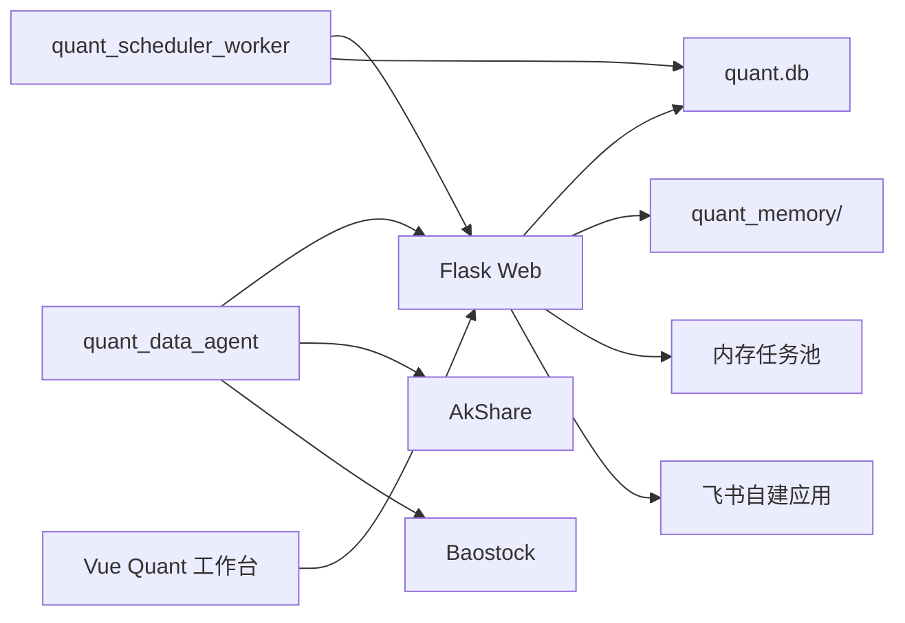
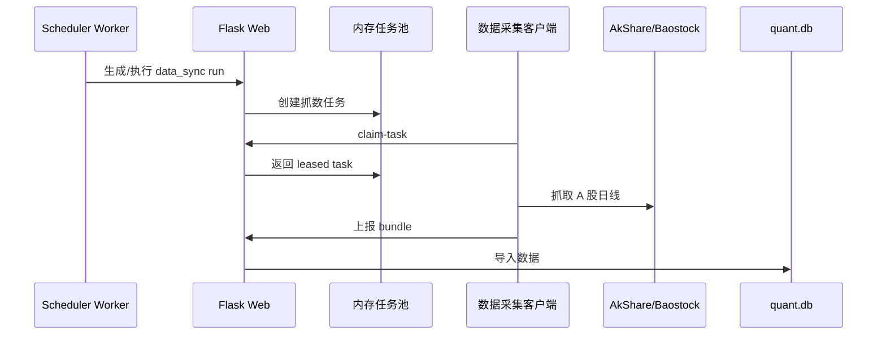
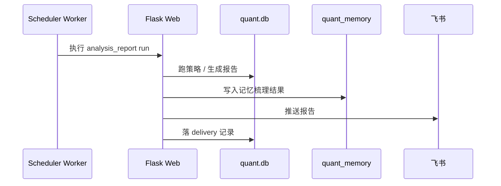
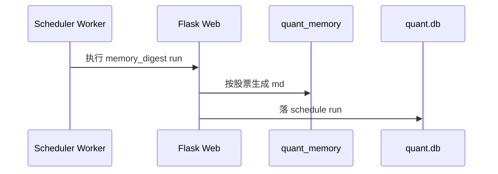

# Quant MVP 运行与交接手册

本文是当前 quant MVP 的交接版 runbook，只保留现状、部署入口、飞书配置和下一步接手信息。

## 1. 当前状态

当前已经完成的能力：

- 独立 `quant.db`，不再依赖 `log.db`
- 主服务 `Flask Web`
- 单实例 `quant_scheduler_worker`
- 独立数据采集客户端 `quant_data_agent`
- 策略、规则、回测、报告、记忆、持仓管理
- 飞书自建应用 IM 主链路
- 前端 `quant` 工作台子页面化

当前不再保留的链路：

- 旧 IM 分支（已删除）
- 自动下单

## 2. 基础架构

### 2.1 组件

1. Web 服务：`cyf/project/server/server.py`
2. 调度 worker：`cyf/project/server/worker/quant_scheduler_worker.py`
3. 数据采集客户端：`cyf/project/server/quant_client/cli.py`
4. 兼容入口：`cyf/project/server/worker/quant_data_agent.py`
5. 飞书 IM 服务：`cyf/project/server/service/quant/im_service.py`
6. 前端工作台：`cyf/project/fe/src/views/quant/`

### 2.2 拓扑



### 2.3 关键代码位置

- 配置读取：`cyf/project/server/conf/settings.py`
- 量化数据库：`cyf/project/server/quant/db.py`
- 量化实体：`cyf/project/server/quant/entities.py`
- IM 服务：`cyf/project/server/service/quant/im_service.py`
- 调度路由：`cyf/project/server/routes/quant_routes.py`
- 前端工作台状态：`cyf/project/fe/src/composables/useQuantWorkbench.ts`
- 前端 IM 页面：`cyf/project/fe/src/views/quant/pages/QuantImPositionsPage.vue`

## 3. 运行约束

这是当前 MVP 的硬约束：

- 只允许 1 个 Web 实例
- 只允许 1 个 scheduler worker
- 数据任务池是内存态，Web 重启会丢未完成任务
- `quant.db` 必须独立存放
- 量化记忆文件单独放 `quant_memory/`
- IM 只走飞书

## 4. 核心时序

### 4.1 拉数



### 4.2 报告



### 4.3 记忆梳理



## 5. 配置清单

### 5.1 `conf/conf.ini`

最少需要配置：

```ini
[common]
upload_dir=/data/openai-project/uploads
users=
  admin:你的登录密码:可选OpenAIKey

[log]
sqlite3_file=/data/openai-project/log/log.db

[quant]
sqlite3_file=/data/openai-project/quant/quant.db
bundle_dir=/data/openai-project/quant/bundles
memory_dir=/data/openai-project/quant/memory
feishu_app_id=cli_xxx
feishu_app_secret=xxx
feishu_verification_token=xxx
feishu_encrypt_key=

[api]
api_key=
api_host=https://api.openai.com/v1
usd_to_cny_rate=7.2
api_param_mode=default
```

### 5.2 调度建议

当前只做天级数据，建议先配 3 类调度：

- `data_sync`
- `analysis_report`
- `memory_digest`

推荐时间：

- `data_sync`：15:20
- `analysis_report`：15:35
- `memory_digest`：21:30

## 6. 飞书配置

### 6.1 注册应用

1. 打开飞书开放平台。
2. 创建企业自建应用。
3. 开启机器人能力。
4. 复制 `App ID` 和 `App Secret` 回填到 `conf.ini`。

### 6.2 事件订阅

回调地址：

```text
/never_guess_my_usage/quant/im/feishu/events
```

订阅消息事件：

- `im.message.receive_v1`

需要回填：

- `feishu_verification_token`
- `feishu_encrypt_key`（如启用加密）

### 6.3 通道配置

管理台里新建 IM 通道，只保留飞书配置：

- `channel_type=feishu_app`
- `receive_id_type=chat_id`
- `receive_id=oc_xxx`
- `inbound_chat_id` 可空
- `reply_in_thread` 按需

## 7. 启动顺序

### 7.1 Web

```bash
cd /Users/chenyifei.anon/IdeaProjects/openai-project/cyf/project/server
./local-run.sh
```

### 7.2 worker

```bash
cd /Users/chenyifei.anon/IdeaProjects/openai-project/cyf/project/server
python worker/quant_scheduler_worker.py
```

### 7.3 数据客户端

建议在另一进程里循环执行：

```bash
cd /Users/chenyifei.anon/IdeaProjects/openai-project/cyf/project/server
while true; do
  python worker/quant_data_agent.py run-once \
    --server-url http://127.0.0.1:39997 \
    --client-id quant-local-01 \
    --user admin \
    --password 你的密码
  sleep 15
done
```

## 8. 当前工作台

前端量化工作台已经拆成子页面，当前重点入口是：

- 数据中心
- 策略中心
- 调度中心
- 报告中心
- 记忆中心
- IM 与持仓

## 9. 下一位 AI 接手重点

接下来只沿飞书方向继续，不要再引入其它 IM 分支。最值得继续做的事情是：

1. 跑一次全量自检，确认飞书回调、通道 CRUD、报告推送、持仓摘要、测试消息都通。
2. 检查调度 cron 与交易日历是否匹配日频只拉取逻辑。
3. 补齐 `quant.db` 初始化、前端工作台和服务端接口的回归验证。
4. 如果要继续扩展，只在飞书和量化主链路上迭代。

## 10. 风险提示

- Web 重启会丢内存任务池里的未完成任务
- 单 worker 是当前硬约束
- `quant.db` 不要和 `log.db` 混用
- IM 现在只支持飞书主链路
