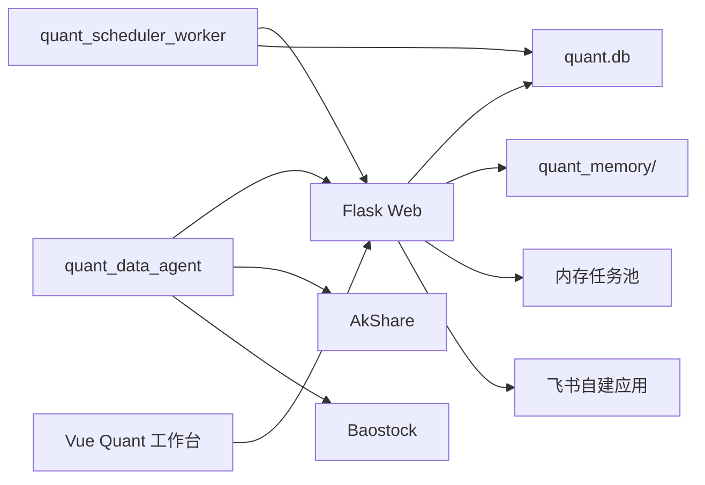
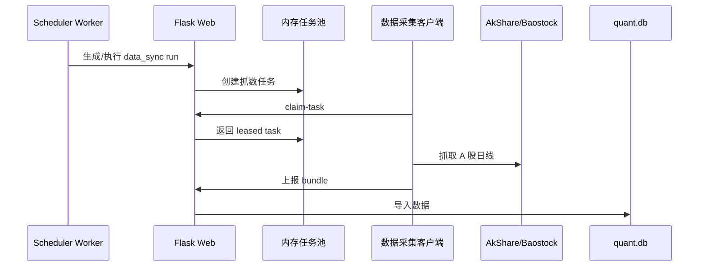
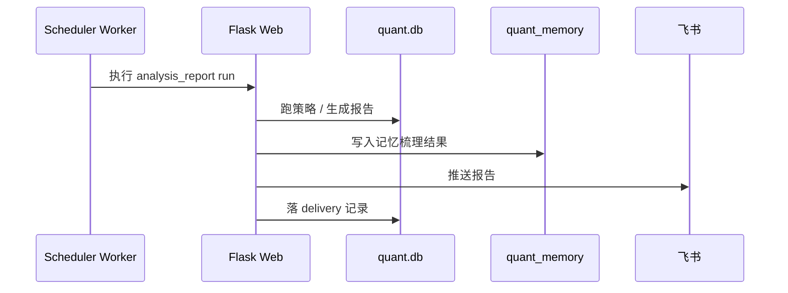
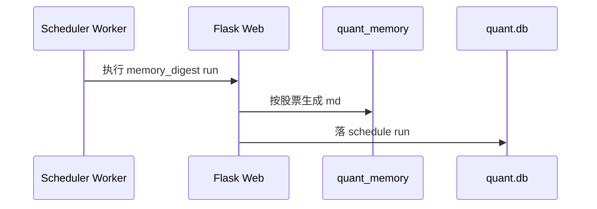
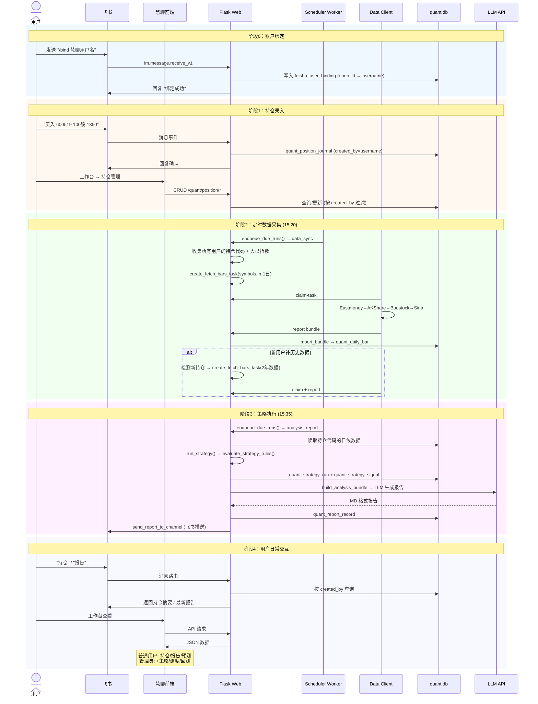

# Quant MVP 运行与交接手册

本文是当前 quant MVP 的交接版 runbook，只保留现状、部署入口、飞书配置和下一步接手信息。

## 1. 当前状态

当前已经完成的能力：

- 独立 `quant.db`，不再依赖 `log.db`
- 主服务 `Flask Web`
- 单实例 `quant_scheduler_worker`
- 独立数据采集客户端 `quant_data_agent`
- 策略、规则、回测、报告、记忆、持仓管理
- 飞书自建应用 IM 主链路
- 前端 `quant` 工作台子页面化

当前不再保留的链路：

- 旧 IM 分支（已删除）
- 自动下单

## 2. 基础架构

### 2.1 组件

1. Web 服务：`cyf/project/server/server.py`
2. 调度 worker：`cyf/project/server/worker/quant_scheduler_worker.py`
3. 数据采集客户端：`cyf/project/server/quant_client/cli.py`
4. 兼容入口：`cyf/project/server/worker/quant_data_agent.py`
5. 飞书 IM 服务：`cyf/project/server/service/quant/im_service.py`
6. 前端工作台：`cyf/project/fe/src/views/quant/`

### 2.2 拓扑



### 2.3 关键代码位置

- 配置读取：`cyf/project/server/conf/settings.py`
- 量化数据库：`cyf/project/server/quant/db.py`
- 量化实体：`cyf/project/server/quant/entities.py`
- IM 服务：`cyf/project/server/service/quant/im_service.py`
- 调度路由：`cyf/project/server/routes/quant_routes.py`
- 前端工作台状态：`cyf/project/fe/src/composables/useQuantWorkbench.ts`
- 前端 IM 页面：`cyf/project/fe/src/views/quant/pages/QuantImPositionsPage.vue`

## 3. 运行约束

这是当前 MVP 的硬约束：

- 只允许 1 个 Web 实例
- 只允许 1 个 scheduler worker
- 数据任务池是内存态，Web 重启会丢未完成任务
- `quant.db` 必须独立存放
- 量化记忆文件单独放 `quant_memory/`
- IM 只走飞书

## 4. 核心时序

### 4.1 拉数



### 4.2 报告



### 4.3 记忆梳理



## 5. 配置清单

### 5.1 `conf/conf.ini`

最少需要配置：

```ini
[common]
upload_dir=/data/openai-project/uploads
users=
  admin:你的登录密码:可选OpenAIKey

[log]
sqlite3_file=/data/openai-project/log/log.db

[quant]
sqlite3_file=/data/openai-project/quant/quant.db
bundle_dir=/data/openai-project/quant/bundles
memory_dir=/data/openai-project/quant/memory
feishu_app_id=cli_xxx
feishu_app_secret=xxx
feishu_verification_token=xxx
feishu_encrypt_key=

[api]
api_key=
api_host=https://api.openai.com/v1
usd_to_cny_rate=7.2
api_param_mode=default
```

### 5.2 调度建议

当前只做天级数据，建议先配 3 类调度：

- `data_sync`
- `analysis_report`
- `memory_digest`

推荐时间：

- `data_sync`：15:20
- `analysis_report`：15:35
- `memory_digest`：21:30

## 6. 飞书配置

### 6.1 注册应用

1. 打开飞书开放平台。
2. 创建企业自建应用。
3. 开启机器人能力。
4. 复制 `App ID` 和 `App Secret` 回填到 `conf.ini`。

### 6.2 事件订阅

回调地址：

```text
/never_guess_my_usage/quant/im/feishu/events
```

订阅消息事件：

- `im.message.receive_v1`

需要回填：

- `feishu_verification_token`
- `feishu_encrypt_key`（如启用加密）

### 6.3 通道配置

管理台里新建 IM 通道，只保留飞书配置：

- `channel_type=feishu_app`
- `receive_id_type=chat_id`
- `receive_id=oc_xxx`
- `inbound_chat_id` 可空
- `reply_in_thread` 按需

## 7. 启动顺序

### 7.1 Web

```bash
cd /Users/chenyifei.anon/IdeaProjects/openai-project/cyf/project/server
./local-run.sh
```

### 7.2 worker

```bash
cd /Users/chenyifei.anon/IdeaProjects/openai-project/cyf/project/server
python worker/quant_scheduler_worker.py
```

### 7.3 数据客户端

建议在另一进程里循环执行：

```bash
cd /Users/chenyifei.anon/IdeaProjects/openai-project/cyf/project/server
while true; do
  python worker/quant_data_agent.py run-once \
    --server-url http://127.0.0.1:39997 \
    --client-id quant-local-01 \
    --user admin \
    --password 你的密码
  sleep 15
done
```

## 8. 当前工作台

前端量化工作台已经拆成子页面，当前重点入口是：

- 数据中心
- 策略中心
- 调度中心
- 报告中心
- 记忆中心
- IM 与持仓

## 9. 下一位 AI 接手重点

接下来只沿飞书方向继续，不要再引入其它 IM 分支。最值得继续做的事情是：

1. 跑一次全量自检，确认飞书回调、通道 CRUD、报告推送、持仓摘要、测试消息都通。
2. 检查调度 cron 与交易日历是否匹配日频只拉取逻辑。
3. 补齐 `quant.db` 初始化、前端工作台和服务端接口的回归验证。
4. 如果要继续扩展，只在飞书和量化主链路上迭代。

## 10. 风险提示

- Web 重启会丢内存任务池里的未完成任务
- 单 worker 是当前硬约束
- `quant.db` 不要和 `log.db` 混用
- IM 现在只支持飞书主链路


---

## 11. 一期完整功能图景

### 11.1 系统时序图



### 11.2 当前状态 vs 需求差距

| # | 需求 | 现有代码 | 差距 | 优先级 |
|---|---|---|---|---|
| 0 | 飞书账户绑定慧聊用户 | `QuantImInboundEvent` 存 `sender_id`，无绑定表 | 需新建 `feishu_user_binding` 表 + `/bind` 命令 + 查询时按绑定用户过滤 | 🔴 P0 |
| 1 | 前端根据 role 控制板块可见性 | 后端有 `require_admin_auth`，前端无角色判断 | 前端需从 login 响应获取 `role`，`QuantLayout` 根据 role 过滤菜单 | 🔴 P0 |
| 2 | 持仓管理按用户隔离 | `QuantPositionJournal.created_by` 有字段但 CRUD 不按用户过滤 | `position_service` 的所有查询需加 `created_by` 参数 | 🔴 P0 |
| 3 | 持仓限制 5 只股票 | 无限流 | `create_position_entry` 加计数检查 | 🟡 P1 |
| 4 | 采集端收集所有用户持仓 + 大盘指数 | 调度 payload 的 symbols 是静态配置 | `_execute_data_sync` 需动态收集所有用户的持仓 symbol + 固定大盘指数列表 | 🔴 P0 |
| 5 | 新用户补 2 年历史数据 | 无独立补数逻辑 | 新建 `backfill_historical_data` 任务类型，检测新持仓后创建独立 task | 🟡 P1 |
| 6 | AI 自动开发策略 | 无 | 需提供策略规则 DSL + 可用指标接口 → LLM 生成 `rule_config` JSON → 试算验证 | 🟢 P2 |
| 7 | 策略试算（回测） | `backtest_service.py` 有 `run_backtest`，`rule_engine.py` 有信号评估 | 回测需要跑历史全部交易日，当前可能只支持单日信号 | 🟡 P1 |
| 8 | 报告按用户推送 | `send_report_to_channel` 用固定 channel | 需按飞书绑定关系找到用户对应 channel 推送 | 🔴 P0 |
| 9 | 业务数据录入/配置入口 | 前端有 `QuantOperationsPage`，`QuantStrategyPage` 等 | 基本完备，缺 prompt template 的可视化编辑、任务重试/重算的 UI | 🟡 P1 |
| 10 | 报告模板/提示词调整 | `QuantPromptTemplate` 表 + `report_service` CRUD | 前端缺对应的编辑页面 | 🟡 P1 |

### 11.3 待开发清单（按优先级）

#### P0 — 阻塞上线

```
□ 飞书-慧聊用户绑定
  ├── 新建 quant_feishu_user_binding 表 (open_id, username, created_at)
  ├── IM 命令 "/bind {username}" → 写入绑定
  ├── IM 命令 "/unbind" → 删除绑定
  ├── position_service CRUD 按 created_by(→username) 过滤
  ├── send_report_to_channel 按绑定找 channel
  └── 持仓摘要 / 报告查询按 created_by 过滤

□ 前端角色权限
  ├── login 响应已含 role 字段，前端 stores 存 role
  ├── QuantLayout 侧边栏: admin 显示全部, user 隐藏策略/调度/回测
  └── 路由守卫: /quant/strategy 等 admin-only 路由重定向

□ 持仓按用户隔离
  ├── create_position_entry 加 created_by 参数
  ├── list_position_journal / list_position_summary 加 created_by 过滤
  └── 前端持仓页面按当前用户过滤 (API 传参)

□ 采集端动态收集持仓
  ├── _execute_data_sync: symbols = 所有用户持仓 symbol ∪ 大盘指数
  ├── 大盘指数固定列表: ['000001.SH','399001.SZ','399006.SZ']
  └── 去重: 多个用户持有同一股票只采集一次

□ 报告按用户推送
  ├── analysis_report 执行时遍历所有绑定用户
  ├── 每个用户按其绑定 channel 推送个性化报告
  └── 或全局报告推送到公共 channel
```

#### P1 — 核心体验

```
□ 持仓上限 5 只
  └── create_position_entry 前 count where created_by=user → ≥ 5 拒绝

□ 新用户补历史数据
  ├── 独立 API: POST /quant/data/backfill → create_fetch_bars_task(2年)
  ├── 调度检测新持仓 → 自动触发补数
  └── 补数完成前标记 "数据准备中"

□ 策略试算（单股回测）
  ├── backtest_service.run_backtest: 遍历历史日线 → evaluate_strategy_rules
  ├── 输出: 总收益率、胜率、最大回撤、信号明细
  └── 前端 QuantBacktestPage 已有，验证功能

□ Prompt Template 管理
  ├── 前端: QuantPromptPage (新建)
  └── CRUD + 预览 + 变量说明 ({strategy_name}, {signals}, {market_summary}...)

□ 任务重试/重算入口
  ├── 前端: scheduler runs 表格加 "重试" 按钮 → reset run status
  └── 报告列表加 "重新生成" 按钮
```

#### P2 — 增强

```
□ AI 策略生成
  ├── API: POST /quant/strategy/generate → LLM 根据指标目录生成 rule_config
  ├── 可用指标接口: GET /quant/strategy/indicators → MA/MACD/RSI/BOLL/KDJ/...
  └── 生成后自动试算 → 展示结果 → 用户决定是否保存

□ 多策略对比
  ├── 同一股票跑多个策略 → 对比信号
  └── 前端: StrategyComparisonPage

□ 前端持仓录入优化
  ├── 接入 symbol_search API 做代码联想
  └── 移动端适配 (飞书小程序 / 慧聊 H5)
```

### 11.4 已就绪的能力（无需额外开发）

```
✅ 数据采集全链路 (claim → fetch → report → import)
✅ 四数据源聚合 (Eastmoney/AKShare/Baostock/Sina)
✅ 东财反限流补丁 (NID + UA 轮换)
✅ 股票模糊搜索 (symbol_search API)
✅ 策略运行引擎 (rule_engine: MA/volume_ratio/breakout_high)
✅ 报告生成 (build_analysis_bundle → LLM → MD)
✅ 飞书 IM 双向通信 (事件接收 + 消息推送)
✅ 调度系统 (cron → enqueue_due_runs → execute)
✅ 仓位流水 CRUD (position_service)
✅ 回测框架 (backtest_service)
✅ 前端工作台 10 页面 (QuantLayout + 子页面)
✅ 交易日历 (trade_calendar_service: A_SHARE)
✅ 记忆梳理 (memory_service: 按股票生成 MD)
✅ 管理后台 API (admin_bp)
```

### 11.5 数据库待建表

```sql
-- 飞书用户绑定
CREATE TABLE quant_feishu_user_binding (
    id INTEGER PRIMARY KEY AUTOINCREMENT,
    feishu_open_id VARCHAR(255) NOT NULL UNIQUE,
    username VARCHAR(255) NOT NULL,
    bound_at DATETIME NOT NULL,
    updated_at DATETIME NOT NULL
);
CREATE INDEX idx_qfub_username ON quant_feishu_user_binding(username);
```

---

## 12. P0 阻塞项开发方案

### 12.1 飞书-慧聊用户绑定

**现状：**
- `QuantImInboundEvent` 会记录飞书消息的 `sender_id`（open_id），但与慧聊 `User` 表无关联
- IM 命令路由 (`im_service._route_feishu_command`) 目前支持的命令：`help`、`持仓`、`报告`，以及 `买入/卖出 代码 数量 价格` 的持仓登记
- 持仓录入 `_try_create_position_from_command` 直接写入 `QuantPositionJournal`，`created_by` 写入的是 `sender_id`（飞书 open_id），不是慧聊用户名
- 报告推送 `send_report_to_channel` 使用的是静态配置的 IM channel，不区分用户

**问题：**
1. 飞书用户和慧聊用户没有映射关系，两个身份体系独立运行
2. 持仓数据无法按慧聊用户隔离和查询
3. 报告无法推送到特定用户

**方案：**

```
新建 quant_feishu_user_binding 表:
  feishu_open_id (UNIQUE) → 飞书 sender_id
  username               → 慧聊用户名

新增 IM 命令:
  /bind {username}        → 验证慧聊用户名+密码 → 写入绑定
  /unbind                 → 删除绑定
  /whoami                 → 查询当前绑定状态

改动点:
  1. im_rules.py: 注册 /bind、/unbind、/whoami 命令处理器
  2. 新建 service/quant/binding_service.py: bind/unbind/get_binding
  3. im_service._try_create_position_from_command: created_by 改为慧聊 username
  4. im_service._route_feishu_command: 持仓查询加 created_by 过滤
  5. 新建 quant/entities.py: QuantFeishuUserBinding 模型
  6. quant/db.py: ensure_quant_schema 加新表创建
```

### 12.2 前端角色权限控制

**现状：**
- 后端 `require_admin_auth` 已有，admin 专有接口（策略CRUD、调度CRUD、任务创建）已被保护
- 前端 `QuantLayout.vue` 侧边栏所有菜单项对所有登录用户可见
- 前端路由无权限守卫，普通用户可直接访问 `/quant/strategy` 等路径
- `useQuantWorkbench.ts` 无 role 状态管理

**问题：**
1. 普通用户可见策略配置、调度配置、回测等管理功能入口（虽然 API 会 401）
2. 侧边栏菜单无差别展示，困惑用户

**方案：**

```
前端改动:
  1. auth store: 从 login 响应保存 user.role
     - httpClient.ts 登录成功回调中 store.commit('setRole', data.role)
  
  2. QuantLayout.vue: 侧边栏菜单按 role 分组
     所有用户可见:
       - 概览 (overview)
       - 数据中心 (data)
       - 策略运行 (runs)
       - 操作记录 (operations)
       - AI 记忆 (ai-memory)
       - IM 持仓 (im-positions)
     admin 独占:
       - 策略中心 (strategy)
       - 回测中心 (backtest)
       - 调度中心 (scheduler)
  
  3. 路由守卫: router.beforeEach 检查 role
     - /quant/strategy、/quant/backtest、/quant/scheduler → role !== 'admin' → redirect /quant/overview
```

### 12.3 持仓按用户隔离

**现状：**
- `QuantPositionJournal` 有 `created_by` 字段
- `position_service.create_position_entry` 接收 `created_by` 参数
- **但** `list_position_journal`、`list_position_summary`、`get_position_entry` 都不按 `created_by` 过滤
- 前端 API 调用不传 `created_by` 参数

**问题：**
1. 所有用户的持仓混在一起，无法区分
2. 用户 A 可以看到用户 B 的持仓记录

**方案：**

```
后端改动:
  1. position_service.py:
     - list_position_journal(created_by=None): 加 where 条件
     - list_position_summary(created_by=None): 加 where 条件
     - get_position_entry(entry_id, created_by=None): 加 ownership 校验
  
  2. routes/quant_routes.py:
     - 所有 position 路由从 @require_auth 获取 user → 传入 created_by
     - require_admin_auth 的路由传 created_by=None（管理员看全部）
  
  3. im_service.py:
     - _route_feishu_command "持仓摘要": 先查 binding → 获取 username → 过滤

前端改动:
  1. QuantImPositionsPage / QuantOperationsPage: 无需额外改动（后端自动按 token 过滤）
```

### 12.4 采集端动态收集用户持仓

**现状：**
- `_execute_data_sync` 从调度配置的 `payload.symbols` 读取静态股票列表
- 调度配置创建时需要手动填写 symbols
- 无大盘指数自动采集

**问题：**
1. 用户新增持仓后，调度不会自动采集该股票的数据
2. 缺少大盘指数（上证、深证、创业板）的日线数据
3. 需要管理员每次手动更新调度 symbols 配置

**方案：**

```
大盘指数固定列表:
  INDEX_SYMBOLS = [
    '000001.SH',  # 上证指数
    '399001.SZ',  # 深证成指
    '399006.SZ',  # 创业板指
    '000688.SH',  # 科创50
    '000300.SH',  # 沪深300
  ]

改动点:
  1. schedule_service._execute_data_sync:
     - 从 quant_position_journal 收集所有 active 持仓的 symbol (去重)
     - 合并 INDEX_SYMBOLS
     - 传入 create_fetch_bars_task(symbols=all_symbols)
  
  2. 为防止重复采集:
     - create_fetch_bars_task 前检查 quant_daily_bar 是否已有当日数据
     - 或依赖 on_conflict_replace 覆盖（当前机制）
```

### 12.5 报告按用户推送

**现状：**
- `_execute_analysis_report` 中 `send_report_to_channel` 使用固定的 `channel_ids`
- 报告内容 `build_analysis_bundle` 基于策略配置的 symbols，不区分用户
- 调度配置创建时手动指定 channel_ids

**问题：**
1. 所有用户收到相同的全局策略报告，不包含个人持仓信息
2. 报告无法推送到用户私聊

**方案：**

```
改动点:
  1. schedule_service._execute_analysis_report:
     - 遍历 quant_feishu_user_binding 获取所有绑定用户
     - 对每个用户:
       a. 查询其持仓 symbols → 按用户跑策略
       b. 生成个性化报告
       c. send_report_to_channel(report_id, channel=用户私聊或配置的群)
  
  2. 替代方案（MVP 阶段更简单）:
     - 全局策略报告推送到公共 channel（现有逻辑）
     - 用户通过飞书 "报告" 命令主动拉取个人报告
     - 个人报告按 created_by 过滤策略运行结果
```

### P0 开发顺序建议

```
第1步: 飞书绑定 (12.1)          ← 基础依赖，其他 P0 项需要 binding 表
第2步: 持仓用户隔离 (12.3)      ← 需要 binding 来关联飞书用户→慧聊用户
第3步: 动态采集持仓 (12.4)      ← 依赖持仓表有正确的 created_by
第4步: 报告按用户推送 (12.5)    ← 依赖 binding + 持仓隔离
第5步: 前端角色权限 (12.2)      ← 纯前端，可并行
```

### 新增文件清单 (P0)

| 文件 | 类型 |
|---|---|
| `quant/entities.py` | 修改: 加 `QuantFeishuUserBinding` |
| `quant/db.py` | 修改: ensure_quant_schema 加新表 |
| `service/quant/binding_service.py` | 新建: bind/unbind/get_binding |
| `service/quant/im_rules.py` | 修改: 注册 /bind、/unbind、/whoami |
| `service/quant/im_service.py` | 修改: 命令处理改 created_by |
| `service/quant/position_service.py` | 修改: 所有查询加 created_by 过滤 |
| `service/quant/schedule_service.py` | 修改: 动态收集持仓 symbols |
| `routes/quant_routes.py` | 修改: position 路由传 created_by |
| `fe/src/stores/auth.ts` | 修改: 存 role |
| `fe/src/views/quant/QuantLayout.vue` | 修改: 菜单按 role 分组 |
| `fe/src/router/index.ts` | 修改: 路由守卫 |
